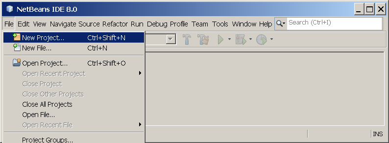
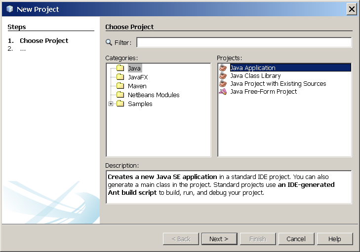
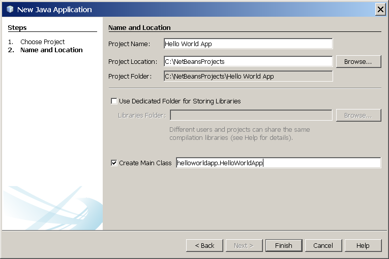
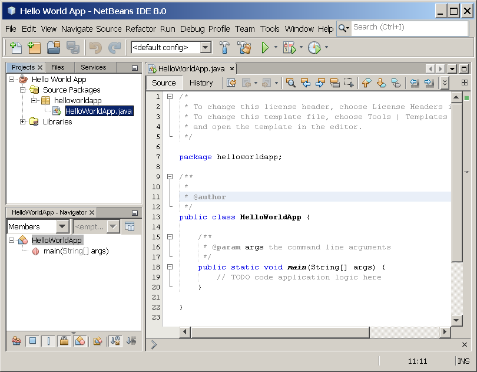
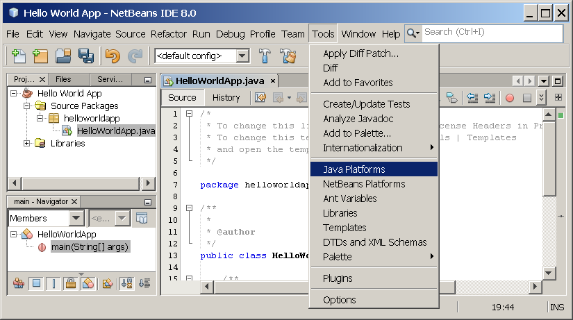
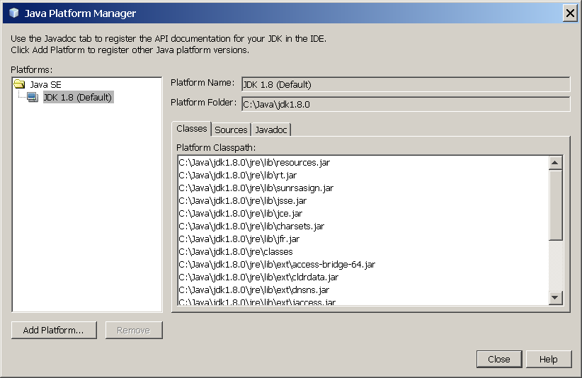
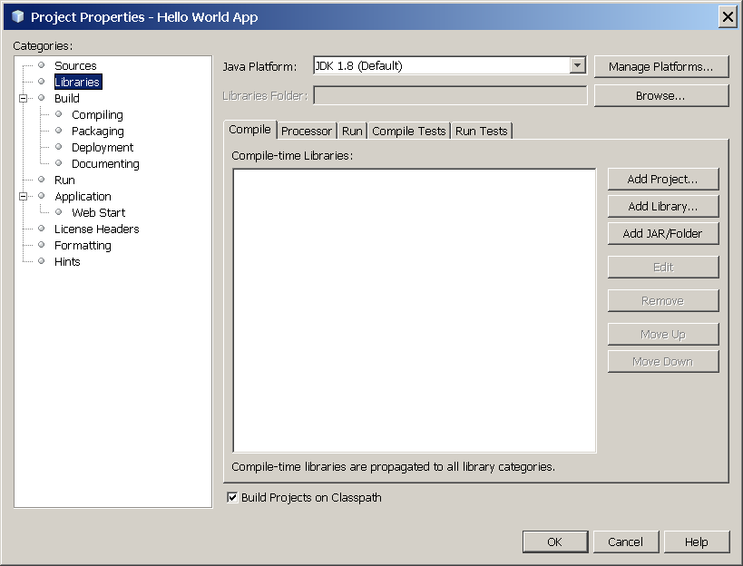
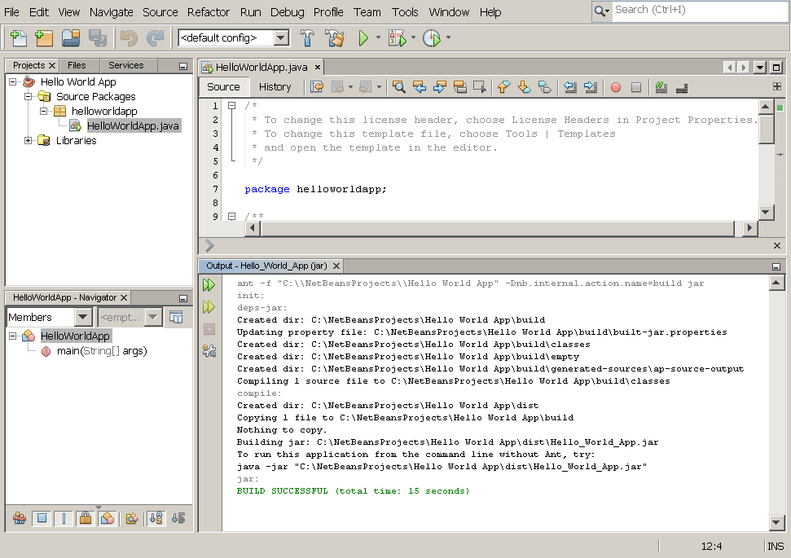
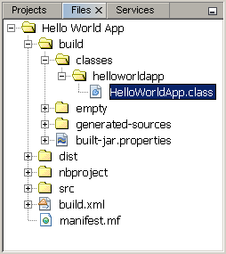
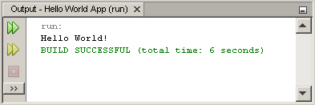

# NetBeans IDE 上的“你好，世界！”

> 原文： [https://docs.oracle.com/javase/tutorial/getStarted/cupojava/netbeans.html](https://docs.oracle.com/javase/tutorial/getStarted/cupojava/netbeans.html)

是时候编写你的第一个应用程序了！这些详细说明适用于 NetBeans IDE 的用户。 NetBeans IDE 在 Java 平台上运行，这意味着您可以将其用于任何可用 JDK 的操作系统。这些操作系统包括 Microsoft Windows，Solaris OS，Linux 和 Mac OS X.

*   [清单](#netbeans-1)
*   [创建您的第一个应用程序](#netbeans-2)
    *   [创建一个 IDE 项目](#netbeans-2a)
    *   [将 JDK 8 添加到平台列表中（如有必要）](#netbeans-jdk)
    *   [将代码添加到生成的源文件](#netbeans-2b)
    *   [编译源文件](#netbeans-2c)
    *   [运行程序](#netbeans-2d)
*   [继续使用 NetBeans IDE 教程](#netbeans-3)

* * *

## A 清单

要编写第一个程序，您需要：

1.  Java SE 开发工具包（在此示例中已选择 JDK 7）

    *   对于 Microsoft Windows，Solaris OS 和 Linux： [Java SE 下载索引](http://www.oracle.com/technetwork/java/javase/downloads/index.html)页面
    *   对于 Mac OS X： [developer.apple.com](https://developer.apple.com/)
2.  NetBeans IDE

    *   对于所有平台： [NetBeans IDE 下载索引](http://netbeans.org/downloads/index.html)页面

* * *

## 创建您的第一个应用程序

您的第一个应用程序`HelloWorldApp`将只显示问候语“Hello World！”要创建此程序，您将：

*   创建一个 IDE 项目

    创建 IDE 项目时，您将创建一个用于构建和运行应用程序的环境。使用 IDE 项目消除了通常与在命令行上进行开发相关的配置问题。您可以通过在 IDE 中选择单个菜单项来构建或运行应用程序。

*   将代码添加到生成的源文件中

    源文件包含用 Java 编程语言编写的代码，您和其他程序员可以理解这些代码。作为创建 IDE 项目的一部分，将自动生成框架源文件。然后，您将修改源文件以添加“Hello World！”信息。

*   将源文件编译为.class 文件

    IDE 调用 Java 编程语言 _ 编译器 _ `(javac)`，它接收源文件并将其文本转换为 Java 虚拟机可以理解的指令。该文件中包含的指令称为 _ 字节码 _。

*   运行程序

    IDE 调用 Java 应用程序 _ 启动程序工具 _（`java`），它使用 Java 虚拟机来运行您的应用程序。

### 创建一个 IDE 项目

要创建 IDE 项目：

1.  启动 NetBeans IDE。

    *   在 Microsoft Windows 系统上，您可以使用“开始”菜单中的 NetBeans IDE 项。

    *   在 Solaris OS 和 Linux 系统上，通过导航到 IDE 的`bin`目录并键入`./netbeans.`来执行 IDE 启动程序脚本

    *   在 Mac OS X 系统上，单击 NetBeans IDE 应用程序图标。

2.  在 NetBeans IDE 中，选择 **File** | **新项目......** 。

    &lt;center&gt;

    NetBeans IDE 与文件|选择了新项目菜单项。

    &lt;/center&gt;

3.  在 **New Project** 向导中，展开 **Java** 类别并选择 **Java Application** ，如下图所示：

    &lt;center&gt;

    NetBeans IDE，“新建项目”向导，选择“项目”页面。

    &lt;/center&gt;

4.  在向导的**名称和位置**页面中，执行以下操作（如下图所示）：

    *   在**项目名称**字段中，键入`Hello World App`。

    *   在**创建主类**字段中，键入`helloworldapp.HelloWorldApp`。

    &lt;center&gt;

    NetBeans IDE，“新建项目”向导，“名称和位置”页面。

    &lt;/center&gt;

5.  单击完成。

该项目在 IDE 中创建并打开。您应该看到以下组件：

*   **Projects** 窗口，其中包含项目组件的树视图，包括源文件，代码所依赖的库等。

*   **源编辑器**窗口打开一个名为`HelloWorldApp.java`的文件。

*   **Navigator** 窗口，可用于在所选类中的元素之间快速导航。

    &lt;center&gt;

    打开 HelloWorldApp 项目的 NetBeans IDE。

    &lt;/center&gt;

* * *

### 将 JDK 8 添加到平台列表中（如有必要）

可能需要将 JDK 8 添加到 IDE 的可用平台列表中。为此，请选择“工具”| Java 平台如下图所示：



从“工具”菜单中选择 Java Platform Manager


如果在安装的平台列表中没有看到 JDK 8（可能显示为 1.8 或 1.8.0），请单击**添加平台**，导航到 JDK 8 安装目录，然后单击**完成**。您现在应该看到这个新添加的平台：



Java 平台管理器


要将此 JDK 设置为所有项目的默认值，可以在命令行上使用`--jdkhome`开关运行 IDE，或者在`INSTALLATION_DIRECTORY/etc/netbeans.conf`文件的`netbeans_j2sdkhome`属性中输入 JDK 的路径。

要仅为当前项目指定此 JDK，请在 **Projects** 窗格中选择 **Hello World App** ，选择**文件** | **项目属性（Hello World App）**，单击**库**，然后在 **Java 平台**下拉菜单中选择 **JDK 1.8** 。您应该看到类似于以下内容的屏幕：



IDE 现在配置为 JDK 8。

* * *

### 将代码添加到生成的源文件中

创建此项目时，您在 **New Project** 向导中选中了 **Create Main Class** 复选框。因此，IDE 为您创建了一个框架类。你可以添加“Hello World！”通过替换行来向骨架代码发送消息：

```
// TODO code application logic here

```

与线：

```
System.out.println("Hello World!"); // Display the string.

```

或者，您可以替换这四行生成的代码：

```
/**
 *
 * @author
 */

```

用这些线：

```
/**
 * The HelloWorldApp class implements an application that
 * simply prints "Hello World!" to standard output.
 */

```

这四行是代码注释，不影响程序的运行方式。本教程后面的部分将介绍代码注释的用法和格式。

**输入**  时要小心

* * *

**Note:** Type all code, commands, and file names exactly as shown. Both the compiler (`javac`) and launcher (`java`) are _case-sensitive_, so you must capitalize consistently.

`HelloWorldApp` is _not_ the same as `helloworldapp`.

* * *

选择**文件** |保存更改**保存**。

该文件应如下所示：

```
/*
 * To change this template, choose Tools | Templates
 * and open the template in the editor.
 */

package helloworldapp;

/**
 * The HelloWorldApp class implements an application that
 * simply prints "Hello World!" to standard output.
 */
public class HelloWorldApp {

    /**
     * @param args the command line arguments
     */
    public static void main(String[] args) {
        System.out.println("Hello World!"); // Display the string.
    }

}

```

### 将源文件编译为.class 文件

要编译源文件，请选择**运行** | **从 IDE 的主菜单中构建项目（Hello World App）**。

“输出”窗口将打开并显示类似于下图中所示的输出：



输出窗口显示构建 HelloWorld 项目的结果。


如果构建输出以语句`BUILD SUCCESSFUL`结束，恭喜！您已成功编译了您的程序！

如果构建输出以语句`BUILD FAILED`结束，则代码中可能存在语法错误。错误在“输出”窗口中报告为超链接文本。双击此类超链接以导航到错误源。然后您可以修复错误并再次选择**运行** | **建设项目**。

构建项目时，会生成字节码文件`HelloWorldApp.class`。您可以通过打开 **Files** 窗口并展开 **Hello World App / build / classes / helloworldapp** 节点来查看新文件的生成位置，如下图所示。



“文件”窗口，显示生成的.class 文件。


现在您已经构建了项目，您可以运行您的程序。

### 运行程序

从 IDE 的菜单栏中，选择**运行** | **运行主项目**。

下图显示了您现在应该看到的内容。



该程序打印“Hello World！”到“输出”窗口（以及构建脚本的其他输出）。


恭喜！你的程序有效！

## 继续使用 NetBeans IDE 进行教程

本教程的下几页将解释这个简单应用程序中的代码。之后，课程将更深入地介绍核心语言功能，并提供更多示例。虽然本教程的其余部分未提供有关使用 NetBeans IDE 的具体说明，但您可以轻松使用 IDE 编写和运行示例代码。以下是有关使用 IDE 的一些提示以及您可能会看到的某些 IDE 行为的说明：

*   在 IDE 中创建项目后，可以使用 **New File** 向导将文件添加到项目中。选择**文件** | **新建文件**，然后在向导中选择一个模板，例如 Empty Java File 模板。

*   您可以使用 IDE 的**编译文件**（F9）和**运行文件**（Shift-F6）命令编译和运行单个文件（而不是整个项目）。如果使用**运行主项目**命令，IDE 将运行 IDE 关联的文件作为主项目的主类。因此，如果在 HelloWorldApp 项目中创建其他类，然后尝试使用**运行主项目**命令运行该文件，则 IDE 将运行`HelloWorldApp`文件。

*   您可能希望为包含多个源文件的示例应用程序创建单独的 IDE 项目。

*   当您在 IDE 中键入时，可能会定期出现代码完成框。您可以忽略代码完成框并继续键入，也可以选择其中一个建议的表达式。如果您不希望自动显示代码完成框，则可以关闭该功能。选择**工具** | **选项** | **编辑器**，单击**代码完成**选项卡并清除**自动弹出窗口完成窗口**复选框。

*   如果要在 **Projects** 窗口中重命名源文件的节点，请从 IDE 的主菜单中选择 **Refactor** 。 IDE 会提示您使用**重命名**对话框引导您完成重命名类和更新引用该类的代码的选项。进行更改并单击 **Refactor** 以应用更改。如果您的项目中只有一个类，则这一点击顺序似乎是不必要的，但是当您的更改影响较大项目中代码的其他部分时，它非常有用。

*   有关 NetBeans IDE 功能的更全面指南，请参见 [NetBeans 文档](https://netbeans.org/kb/)页面。