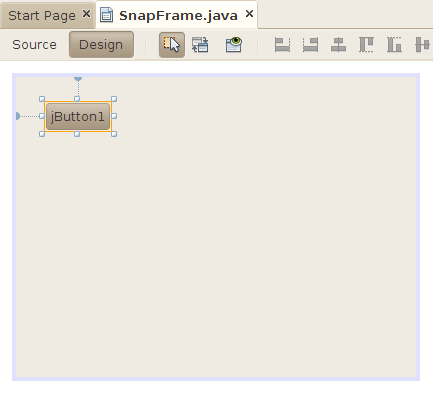
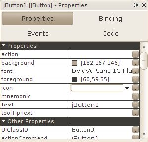
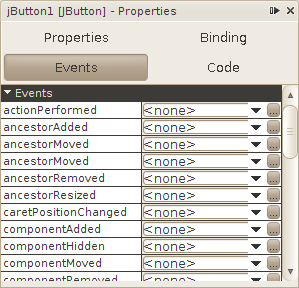
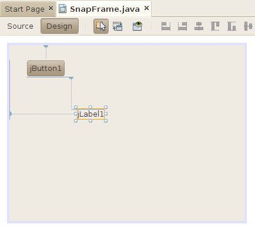

# 按钮是一个 Bean

> 原文： [https://docs.oracle.com/javase/tutorial/javabeans/quick/button.html](https://docs.oracle.com/javase/tutorial/javabeans/quick/button.html)

仔细看看 **Palette** 。列出的所有组件都是 bean。组件按功能分组。滚动查找 **Swing Controls** 组，然后单击**按钮**并将其拖动到可视设计器中。按钮是一个豆！

在 NetBeans 右侧的调色板下面是一个检查器窗格，您可以使用它来检查和操作按钮。尝试关闭底部的输出窗口，为检查器窗格提供更多空间。

## 属性

bean 的属性是可以改变的影响其外观或内部状态的东西。对于此示例中的按钮，属性包括前景色，字体和按钮上显示的文本。属性显示在两组中。 **属性**列出了最常用的属性，而**其他属性**显示了较少使用的属性。

继续编辑按钮的属性。对于某些属性，您可以直接在表中键入值。对于其他人，单击 **...** 按钮编辑值。例如，单击**前景**属性右侧的 **...** 。弹出一个颜色选择器对话框，您可以为按钮上的前景文本选择一种新颜色。尝试其他一些属性，看看会发生什么。请注意，您没有编写任何代码。

## 活动

豆类也可以发射事件。单击 bean 属性窗格中的 **Events** 按钮。您将看到按钮能够触发的每个事件的列表。

您可以使用 NetBeans 使用其事件和属性来连接 Bean。要查看其工作原理，请将 **Label** 从调色板中拖出`SnapFrame`的可视化设计器。

编辑标签的属性，直到它看起来很完美。