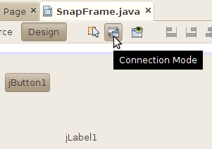
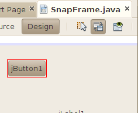
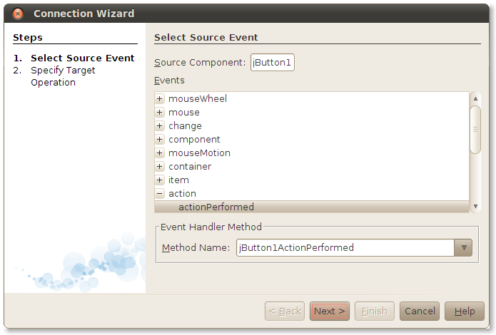
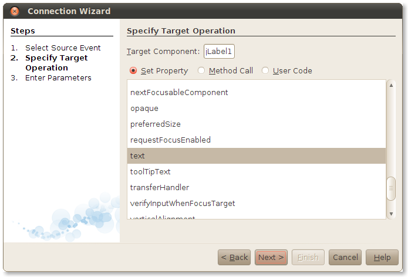
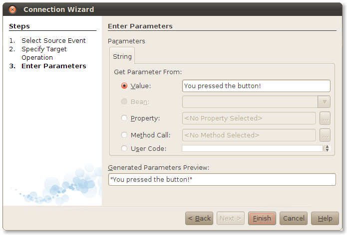
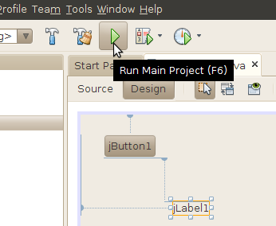
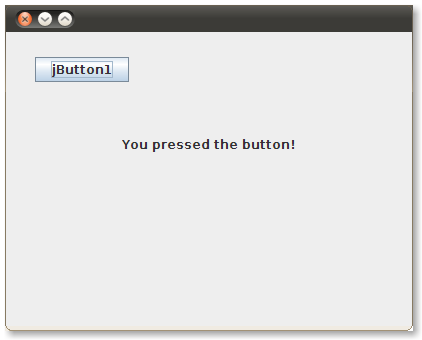

# 连线申请

> 原文： [https://docs.oracle.com/javase/tutorial/javabeans/quick/wiring.html](https://docs.oracle.com/javase/tutorial/javabeans/quick/wiring.html)

要将按钮和标签连接在一起，请单击可视设计器工具栏中的**连接模式**按钮。

单击`SnapFrame`表单中的按钮。 NetBeans 将红色按钮概述为显示它是将生成事件的组件。

单击标签。弹出 NetBeans 的**连接向导**。首先，您将选择您想要回复的活动。对于按钮，这是**动作**事件。单击**动作**旁边的 **+** ，然后选择 **actionPerformed** 。点击**下一步&gt;** 。

现在您可以选择当按钮触发**动作**事件时会发生什么。 **连接向导**列出了标签 bean 中的所有属性。在列表中选择**文本**，然后单击**下一步**。

在**连接向导**的最终屏幕中，填写您希望为**文本**属性设置的值。点击 **Value** ，然后输入**你按下了按钮！** 或同样雄辩的东西。单击**完成**。

NetBeans 将组件连接在一起，并在源代码编辑器中向您展示其手工。

单击源代码工具栏中的 **Design** 按钮返回 UI 设计器。单击**运行主项目**或按 **F6** 构建并运行项目。

NetBeans 构建并运行项目。它要求您识别主类，即`SnapFrame`。弹出应用程序窗口时，单击按钮。你会在标签上看到你不朽的散文。

请注意，您没有编写任何代码。这是 JavaBeans 的真正强大功能 - 使用像 NetBeans 这样的良好构建器工具，您可以快速将组件连接在一起以创建正在运行的应用程序。