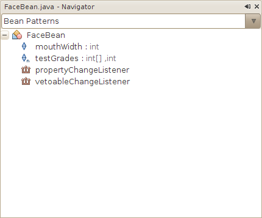

# 属性

> 原文： [https://docs.oracle.com/javase/tutorial/javabeans/writing/properties.html](https://docs.oracle.com/javase/tutorial/javabeans/writing/properties.html)

要在 bean 类中定义属性，请提供 public getter 和 setter 方法。例如，以下方法定义名为`mouthWidth`的`int`属性：

```java
public class FaceBean {
    private int mMouthWidth = 90;

    public int getMouthWidth() {
        return mMouthWidth;
    }

    public void setMouthWidth(int mw) {
        mMouthWidth = mw;
    }
}

```

像 NetBeans 这样的构建器工具可识别方法名称，并在其属性列表中显示`mouthWidth`属性。它还识别类型`int`，并提供适当的编辑器，以便在设计时操作属性。

此示例显示了可以读取和写入的属性。其他组合也是可能的。例如，只读属性具有 getter 方法但没有 setter。只写属性仅具有 setter 方法。

`boolean`属性的特殊情况允许使用`is`而不是`get`定义访问器方法。例如，`boolean`属性`running`的访问者可以如下：

```java
public boolean isRunning() {
    // ...
}

```

可以使用各种基本属性的特殊化，并在以下各节中进行介绍。

## 索引属性

*索引*属性是一个数组而不是单个值。在这种情况下，bean 类提供了获取和设置整个数组的方法。以下是名为`testGrades`的`int[]`属性的示例：

```java
public int[] getTestGrades() {
    return mTestGrades;
}

public void setTestGrades(int[] tg) {
    mTestGrades = tg;
}

```

对于索引属性，bean 类还提供了获取和设置数组的特定元素的方法。

```java
public int getTestGrades(int index) {
    return mTestGrades[index];
}

public void setTestGrades(int index, int grade) {
    mTestGrades[index] = grade;
}

```

*绑定*属性会在监听器的值发生变化时通知它。这有两个含义：

1.  bean 类包括用于管理 bean 的监听器的`addPropertyChangeListener()`和`removePropertyChangeListener()`方法。
2.  当绑定属性发生更改时，bean 会向其注册的监听器发送`PropertyChangeEvent`。

`PropertyChangeEvent`和`PropertyChangeListener`存在于`java.beans`包中。

`java.beans`包还包含一个类`PropertyChangeSupport`，它负责绑定属性的大部分工作。这个方便的类跟踪属性监听器，并包含一个方便的方法，可以向所有已注册的监听器触发属性更改事件。

以下示例显示如何使用`PropertyChangeSupport`使`mouthWidth`属性成为绑定属性。绑定属性的必要添加内容以粗体显示。

```java
import java.beans.*;

public class FaceBean {
    private int mMouthWidth = 90;
    private PropertyChangeSupport mPcs =
        new PropertyChangeSupport(this);

    public int getMouthWidth() {
        return mMouthWidth;
    }

    public void setMouthWidth(int mw) {
        int oldMouthWidth = mMouthWidth;
        mMouthWidth = mw;
        mPcs.firePropertyChange("mouthWidth",
                                   oldMouthWidth, mw);
    }

    public void
    addPropertyChangeListener(PropertyChangeListener listener) {
        mPcs.addPropertyChangeListener(listener);
    }

    public void
    removePropertyChangeListener(PropertyChangeListener listener) {
        mPcs.removePropertyChangeListener(listener);
    }
}

```

绑定属性可以使用 NetBeans 等构建器工具直接绑定到其他 bean 属性。例如，您可以获取滑块组件的`value`属性并将其绑定到示例中显示的`mouthWidth`属性。 NetBeans 允许您在不编写任何代码的情况下执行此操作。

## 约束属性

*约束*属性是一种特殊的绑定属性。对于约束属性，bean 会跟踪一组*否决*监听器。当约束属性即将更改时，将向监听器咨询有关更改的信息。任何一个听众都有机会否决这一变化，在这种情况下，该财产保持不变。

否决听众与财产变更听众分开。幸运的是，`java.beans`包中包含一个`VetoableChangeSupport`类，可以大大简化约束属性。

对`mouthWidth`示例的更改以粗体显示：

```java
import java.beans.*;

public class FaceBean {
    private int mMouthWidth = 90;
    private PropertyChangeSupport mPcs =
        new PropertyChangeSupport(this);
    private VetoableChangeSupport mVcs =
        new VetoableChangeSupport(this);

    public int getMouthWidth() {
        return mMouthWidth;
    }

    public void
    setMouthWidth(int mw) throws PropertyVetoException {
        int oldMouthWidth = mMouthWidth;
        mVcs.fireVetoableChange("mouthWidth",
                                    oldMouthWidth, mw);
        mMouthWidth = mw;
        mPcs.firePropertyChange("mouthWidth",
                                 oldMouthWidth, mw);
    }

    public void
    addPropertyChangeListener(PropertyChangeListener listener) {
        mPcs.addPropertyChangeListener(listener);
    }

    public void
    removePropertyChangeListener(PropertyChangeListener listener) {
        mPcs.removePropertyChangeListener(listener);
    }

    public void
    addVetoableChangeListener(VetoableChangeListener listener) {
        mVcs.addVetoableChangeListener(listener);
    }

    public void
    removeVetoableChangeListener(VetoableChangeListener listener) {
        mVcs.removeVetoableChangeListener(listener);
    }
}

```

## NetBeans 中的开发支持

用于创建 bean 属性的编码模式很简单，但有时很难判断您是否正确地使用了所有内容。 NetBeans 支持属性模式，因此您可以在编写代码时立即看到结果。

要利用此功能，请查看 **Navigator** 窗格，该窗格通常位于 NetBeans 窗口的左下角。通常，此窗格处于**成员视图**模式，该模式显示当前类中定义的所有方法和字段。

单击组合框切换到 **Bean Patterns** 视图。您将看到 NetBeans 可以从方法定义推断出的属性列表。 NetBeans 在您键入时更新此列表，使其成为检查您的工作的便捷方式。

在以下示例中，NetBeans 已找到读写`mouthWidth`属性和读写索引`testGrades`属性。此外，NetBeans 已经认识到`FaceBean`允许注册`PropertyChangeListener`和`VetoableChangeListener`。

