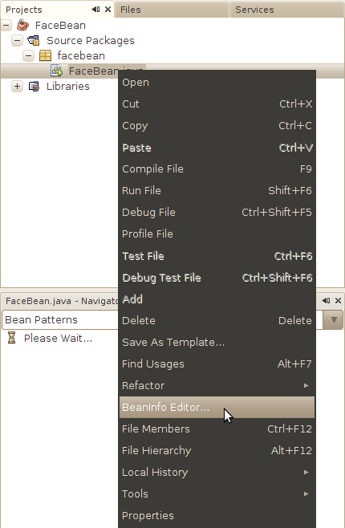
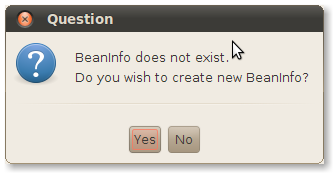
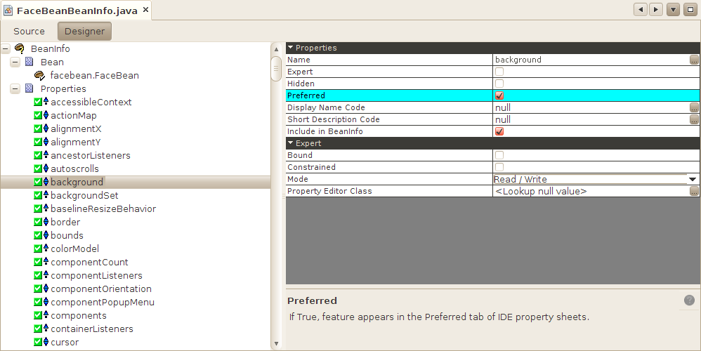

# 使用 BeanInfo

> 原文： [https://docs.oracle.com/javase/tutorial/javabeans/writing/beaninfo.html](https://docs.oracle.com/javase/tutorial/javabeans/writing/beaninfo.html)

豆类，尤其是图形组件，可以拥有令人眼花缭乱的特性。如果您的类继承自`Component`，`JComponent`或其他 Swing 类，则它将具有超过一百个属性。尽管像 NetBeans 这样的构建器工具可以轻松编辑 bean 属性，但很难找到合适的属性进行编辑，尤其是对于没有经验的程序员。

## `BeanInfo`概述

`BeanInfo`是一个更改 bean 在构建器工具中的显示方式的类。构建器工具可以查询`BeanInfo`以找出它应首先显示哪些属性以及应隐藏哪些属性。

bean 的`BeanInfo`类应与 bean 类同名，并附加`BeanInfo`。例如，`FaceBean`类具有描述它的相应`FaceBeanBeanInfo`类。

虽然可以“手动”实现`BeanInfo`类，但您会发现使用 NetBeans 等工具编辑`BeanInfo`要容易得多。

## 在 NetBeans 中创建`BeanInfo`

在 **Projects** 窗格中，按住 Control 键并单击 bean 类的名称，然后从弹出菜单中选择 **BeanInfo Editor ...** 。

NetBeans 注意到您没有`BeanInfo`并询问您是否要创建一个。单击**是**。

NetBeans 创建了一个新类，并将您引入源代码编辑器。单击 **Designer** 切换到可视编辑器。

Click for full image

从可视编辑器左侧的列表中选择属性，然后在右侧编辑其属性。如果您不希望使用构建器工具向开发人员显示特定属性，请单击 **Hidden** 。要表示应在其他人之前显示属性，请单击**首选**。您还可以指示属性是绑定还是约束。

您可以为 bean 的事件源和方法提供类似的信息。

当构建器工具加载您的 bean 类以将其添加到调色板时，它将自动找到相应的`BeanInfo`并使用它来决定如何将 bean 呈现给开发人员。