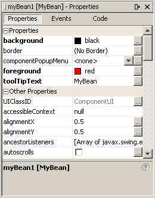

# Bean 定制

> 原文： [https://docs.oracle.com/javase/tutorial/javabeans/advanced/customization.html](https://docs.oracle.com/javase/tutorial/javabeans/advanced/customization.html)

_ 定制*提供了一种在应用程序构建器中修改 bean 的外观和行为的方法，以满足您的特定需求。 bean 开发人员可以使用多个级别的自定义，以允许其他开发人员从 bean 的潜在功能中获得最大收益。

* * *

以下链接对于了解属性编辑器和定制器非常有用：

*   [`PropertyEditor`](https://docs.oracle.com/javase/8/docs/api/java/beans/PropertyEditor.html) 接口
*   [`PropertyEditorSupport`](https://docs.oracle.com/javase/8/docs/api/java/beans/PropertyEditorSupport.html) 类
*   [`PropertyEditorManager`](https://docs.oracle.com/javase/8/docs/api/java/beans/PropertyEditorManager.html) 类
*   [`Customizer`](https://docs.oracle.com/javase/8/docs/api/java/beans/Customizer.html) 接口
*   [`BeanInfo`](https://docs.oracle.com/javase/8/docs/api/java/beans/BeanInfo.html) 接口

* * *

可以在符合 Bean 的构建器工具中的设计时自定义 bean 的外观和行为。有两种方法可以自定义 bean：

*   使用*属性编辑器*。每个 bean 属性都有自己的属性编辑器。 NetBeans GUI Builder 通常在“属性”窗口中显示 bean 的属性编辑器。与特定属性类型关联的属性编辑器编辑该属性类型。
*   使用*定制器*。定制程序为您提供了对 bean 自定义的完整 GUI 控制。在属性编辑器不实用或不适用的情况下使用定制器。与属性关联的属性编辑器不同，自定义程序与 bean 关联。

## 物业编辑

属性编辑器是用于自定义特定属性类型的工具。属性编辑器在“属性”窗口中激活。此窗口确定属性的类型，搜索相关的属性编辑器，并以相关方式显示属性的当前值。

属性编辑器必须实现`PropertyEditor`接口，该接口提供了指定属性如何在属性表中显示的方法。下图表示包含`myBean1`属性的“属性”窗口：



您可以通过单击属性条目开始编辑这些属性的过程。单击大多数这些条目将显示单独的面板。例如，要设置`foreground`或`background`使用选择框选择颜色，或按“...”按钮使用标准 ColorEditor 窗口。单击`toolTipText`属性将打开 StringEditor 窗口。

支持类`PropertyEditorSupport`提供`PropertyEditor`接口的默认实现。通过从`PropertyEditorSupport`继承属性编辑器，您可以简单地覆盖所需的方法。

要在“属性”窗口中显示当前属性值“sample”，需要覆盖`isPaintable`以返回`true`。然后，必须覆盖`paintValue`以在属性表中的矩形中绘制当前属性值。这是`ColorEditor`实现`paintValue`的方式：

```java
public void paintValue(java.awt.Graphics gfx, java.awt.Rectangle box) {
    Color oldColor = gfx.getColor();
    gfx.setColor(Color.black);
    gfx.drawRect(box.x, box.y, box.width-3, box.height-3);
    gfx.setColor(color);
    gfx.fillRect(box.x+1, box.y+1, box.width-4, box.height-4);
    gfx.setColor(oldColor);
}

```

要支持自定义属性编辑器，请覆盖另外两个方法。覆盖`supportsCustomEditor`返回 true，然后覆盖`getCustomEditor`以返回自定义编辑器实例。 `ColorEditor.getCustomEditor`返回`this`。

此外，`PropertyEditorSupport`类维护`PropertyChangeListener`列表，并在更改绑定属性时向这些监听器触发属性更改事件通知。

通过以下方式发现属性编辑器并将其与给定属性相关联：

*   通过`BeanInfo`对象显式关联。标题属性的编辑器使用以下代码行设置：

    ```java
    pd.setPropertyEditorClass(TitleEditor.class);

    ```

*   通过`java.beans.PropertyEditorManager.registerEditor`方法进行显式注册。此方法有两个参数：bean 类类型和与该类型关联的编辑器类。
*   名称搜索。如果类没有显式关联的属性编辑器，那么`PropertyEditorManager`将通过以下方式搜索该类的属性编辑器：
    *   将“Editor”附加到完全限定的类名。例如，对于`my.package.ComplexNumber`类，属性编辑器管理器将搜索`my.package.ComplexNumberEditor`类。
    *   将“编辑器”附加到类名并搜索类路径。

您了解到构建器工具为您提供了创建自己的属性编辑器的支持。视觉建设者应该满足复杂的工业级豆类的其他需求吗？通常不希望在单个（有时是巨大的）属性表上显示 bean 的所有属性。如果关于 bean 类型的一个单一根选择使得一半属性无关紧要怎么办？ JavaBeans 规范提供了用户定义的定制器，通过它可以为 bean 属性定义比属性编辑器更高级别的定制。

当您使用 bean _Customizer_ 时，您可以完全控制如何配置或编辑 bean。 Customizer 是专门针对 bean 定制的应用程序。有时属性不足以表示 bean 的可配置属性。定制器用于需要复杂指令来更改 bean，以及属性编辑器过于原始而无法实现 bean 定制的情况。

所有定制者必须：

*   扩展`java.awt.Component`或其子类之一。
*   实现`java.beans.Customizer`接口这意味着实现注册`PropertyChangeListener`对象的方法，并在发生对目标 bean 的更改时触发这些监听器的属性更改事件。
*   实现默认构造器。
*   通过`BeanInfo.getBeanDescriptor`将定制器与其目标类相关联。