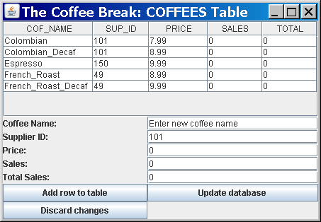

# 将 JDBC 与 GUI API 结合使用

> 原文： [https://docs.oracle.com/javase/tutorial/jdbc/basics/jdbcswing.html](https://docs.oracle.com/javase/tutorial/jdbc/basics/jdbcswing.html)

示例 `[CoffeesFrame.java](gettingstarted.html)`演示了如何将 JDBC 与 GUI API 集成，特别是 Swing API。它在表中显示`COFFEES`数据库表的内容，并包含允许您向表中添加行的字段和按钮。以下是此示例的屏幕截图：



该示例包含五个文本字段，这些字段对应于`COFFEES`表中的每个列。它还包含三个按钮：

*   **向表**添加行：根据在文本字段中输入的数据向样例表中添加一行。
*   **更新数据库**：根据样例表中的数据更新表`COFFEES`。
*   **放弃更改**：检索`COFFEES`表的内容，替换样例表中的现有数据。

此示例（需要`CoffeesTableModel`）演示了将 JDBC 与 Swing API 集成的以下一般步骤：

1.  [实现`TableModel`接口](#implementing_tablemodel)
2.  [实现`RowSetListener`接口](#implemeting_rowsetlistener)
3.  [摆出 Swing 组件](#laying_out_swing)
4.  [为示例中的按钮添加监听器](#adding_listeners)

`TableModel`接口使 Java Swing 应用程序能够管理`JTable`对象中的数据。样例 [`CoffeesTableModel.java`](gettingstarted.html) 实现此接口。它指定`JTable`对象应如何从`RowSet`对象检索数据并将其显示在表中。

**注意**：虽然此示例显示 Swing 应用程序中`COFFEES`表的内容，但类`CoffeesTableModel`应适用于任何 SQL 表，前提是其数据可以用`String`对象表示。 （但是，必须为其他 SQL 表修改允许用户向`COFFEES`添加行的字段，这些字段在`CoffeesFrame`类中指定）。

在实现接口`TableModel`的方法之前，类`CoffeeTableModel`的构造器初始化这些实现方法所需的各种成员变量，如下所示：

```
public CoffeesTableModel(CachedRowSet rowSetArg)
    throws SQLException {

    this.coffeesRowSet = rowSetArg;
    this.metadata = this.coffeesRowSet.getMetaData();
    numcols = metadata.getColumnCount();

    // Retrieve the number of rows.
    this.coffeesRowSet.beforeFirst();
    this.numrows = 0;
    while (this.coffeesRowSet.next()) {
        this.numrows++;
    }
    this.coffeesRowSet.beforeFirst();
}

```

下面描述了在此构造器中初始化的成员变量：

*   `CachedRowSet coffeesRowSet`：存储表`COFFEES`的内容。

    此示例使用`RowSet`对象，特别是`CachedRowSet`对象，而不是`ResultSet`对象，原因有两个。 `CachedRowSet`对象使应用程序的用户可以更改其中包含的数据，而无需连接到数据库。此外，因为`CachedRowSet`对象是 JavaBeans 组件，所以当发生某些事情时，它可以通知其他组件。在此示例中，当新行添加到`CachedRowSet`对象时，它会通知 Swing 组件在表中呈现其数据以刷新自身并显示新行。

*   `ResultSetMetaData metadata`：检索表`COFFEES`中的列数以及每个列的名称。

*   `int numcols, numrows`：分别在表`COFFEES`中存储列数和行数。

`CoffeesTableModel.java`示例从`TableModel`接口实现以下方法：

*   `Class&lt;?&gt; getColumnClass(int columnIndex)`：返回列中所有单元格值的最特定超类。
*   `int getColumnCount()`：返回模型中的列数。
*   `String getColumnName(int columnIndex)`：返回参数`columnIndex`指定的列的名称。
*   `int getRowCount()`：返回模型中的行数。
*   `Object getValueAt(int rowIndex, int columnIndex)`：返回列`columnIndex`和行`rowIndex`交叉处的单元格的值。
*   `boolean isCellEditable(int rowIndex, int columnIndex)`：如果可以编辑`rowIndex`列和行`columnIndex`交叉处的单元格，则返回 true。

以下方法尚未实现，因为此示例不允许用户直接编辑表的内容：

*   `void addTableModelListener(TableModelListener l)`：向每次发生数据模型更改时通知的列表添加监听器。
*   `void removeTableModelListener(TableModelListener l)`：从每次发生数据模型更改时通知的列表中删除监听器。
*   `void setValueAt(Object aValue, int rowIndex, int columnIndex)`：将列`columnIndex`和行`rowIndex`交叉处的单元格中的值设置为对象`aValue`。

### 实现 getColumnCount 和 getRowCount

方法`getColumnCount`和`getRowCount`分别返回成员变量`numcols`和`numrows`的值：

```
public int getColumnCount() {
    return numcols;
}

public int getRowCount() {
    return numrows;
}

```

### 实现 getColumnClass

`getColumnClass`方法返回指定列的数据类型。为简单起见，此方法返回`String`类，从而将表中的所有数据转换为`String`对象。 `JTable`类使用此方法确定如何在 GUI 应用程序中呈现数据。

```
public Class getColumnClass(int column) {
    return String.class;
}

```

### 实现 getColumnName

`getColumnName`方法返回指定列的名称。 `JTable`类使用此方法标记其每个列。

```
public String getColumnName(int column) {
    try {
        return this.metadata.getColumnLabel(column + 1);
    } catch (SQLException e) {
        return e.toString();
    }
}

```

### 实现 getColumnAt

`getColumnAt`方法检索行集`coffeesRowSet`中指定行和列的值。 `JTable`类使用此方法填充其表。请注意，SQL 开始将其行和列编号为 1，但`TableModel`接口从 0 开始;这就是`rowIndex`和`columnIndex`值增加 1 的原因。

```
public Object getValueAt(int rowIndex, int columnIndex) {

    try {
        this.coffeesRowSet.absolute(rowIndex + 1);
        Object o = this.coffeesRowSet.getObject(columnIndex + 1);
        if (o == null)
            return null;
        else
            return o.toString();
    } catch (SQLException e) {
        return e.toString();
    }
}

```

### 实现 isCellEditable

由于此示例不允许用户直接编辑表的内容（行由另一个窗口控件添加），因此无论`rowIndex`和`columnIndex`的值如何，此方法都会返回`false`：

```
public boolean isCellEditable(int rowIndex, int columnIndex) {
    return false;
}

```

类`CoffeesFrame`仅从接口`RowSetListener`，`rowChanged`实现一种方法。当用户向表中添加行时，将调用此方法。

```
public void rowChanged(RowSetEvent event) {

    CachedRowSet currentRowSet =
        this.myCoffeesTableModel.coffeesRowSet;

    try {
        currentRowSet.moveToCurrentRow();
        myCoffeesTableModel = new CoffeesTableModel(
            myCoffeesTableModel.getCoffeesRowSet());
        table.setModel(myCoffeesTableModel);

    } catch (SQLException ex) {

        JDBCTutorialUtilities.printSQLException(ex);

        // Display the error in a dialog box.

        JOptionPane.showMessageDialog(
            CoffeesFrame.this,
            new String[] {
                // Display a 2-line message
                ex.getClass().getName() + ": ",
                ex.getMessage()
            }
        );
    }
}

```

此方法更新 GUI 应用程序中的表。

类`CoffeesFrame`的构造器初始化并布置 Swing 组件。以下语句检索`COFFEES`表的内容，将内容存储在`CachedRowSet`对象`myCachedRowSet`中，并初始化`JTable` Swing 组件：

```
CachedRowSet myCachedRowSet = getContentsOfCoffeesTable();
myCoffeesTableModel = new CoffeesTableModel(myCachedRowSet);
myCoffeesTableModel.addEventHandlersToRowSet(this);

// Displays the table   
table = new JTable(); 
table.setModel(myCoffeesTableModel);

```

如前所述，此示例使用`RowSet`对象，特别是`CachedRowSet`对象，而不是`ResultSet`对象来表示`COFFEES`表的内容。

方法`CoffeesFrame.getContentsOfCoffeesTable`检索表`COFFEES`的内容。

方法`CoffeesTableModel.addEventHandlersToRowSet`将`CoffeesFrame`类中定义的事件处理器（方法`rowChanged`）添加到行集成员变量`CoffeesTableModel.coffeesRowSet`。这使得类`CoffeesFrame`能够通知任何事件的行集`coffeesRowSet`，特别是当用户单击按钮**将行添加到表**，**更新数据库**或**放弃更改**。当行集`coffeesRowSet`被通知其中一个变化时，调用方法`CoffeesFrame.rowChanged`。

语句`table.setModel(myCoffeesTableModel)`指定它使用`CoffeesTableModel`对象`myCoffeesTableModel`填充`JTable` Swing 组件`table`。

以下语句指定`CoffeesFrame`类使用布局`GridBagLayout`来布局其 Swing 组件：

```
Container contentPane = getContentPane();
contentPane.setComponentOrientation(
    ComponentOrientation.LEFT_TO_RIGHT);
contentPane.setLayout(new GridBagLayout());
GridBagConstraints c = new GridBagConstraints();

```

有关使用布局`GridBagLayout`的更多信息，请参见[如何使用 JFC / Swing](../../uiswing/index.html) 创建 GUI 中的 GridBagLayout 。

请参阅 `[CoffeesFrame.java](gettingstarted.html)`的源代码，了解如何将此示例的 Swing 组件添加到布局`GridBagLayout`。

以下语句为按钮添加了一个监听器**向表**添加行：

```
button_ADD_ROW.addActionListener(
    new ActionListener() {

    public void actionPerformed(ActionEvent e) {

        JOptionPane.showMessageDialog(
            CoffeesFrame.this, new String[] {
                "Adding the following row:",
                "Coffee name: [" +
                textField_COF_NAME.getText() +
                "]",
                "Supplier ID: [" +
                textField_SUP_ID.getText() + "]",
                "Price: [" +
                textField_PRICE.getText() + "]",
                "Sales: [" +
                textField_SALES.getText() + "]",
                "Total: [" +
                textField_TOTAL.getText() + "]"
            }
        );

        try {
            myCoffeesTableModel.insertRow(
                textField_COF_NAME.getText(),
                Integer.parseInt(textField_SUP_ID.getText().trim()),
                Float.parseFloat(textField_PRICE.getText().trim()),
                Integer.parseInt(textField_SALES.getText().trim()),
                Integer.parseInt(textField_TOTAL.getText().trim())
            );
        } catch (SQLException sqle) {
            displaySQLExceptionDialog(sqle);
        }
    }
});

```

当用户单击此按钮时，它将执行以下操作：

*   创建一个消息对话框，显示要添加到表中的行。
*   调用方法`CoffeesTableModel.insertRow`，将行添加到成员变量`CoffeesTableModel.coffeesRowSet`。

如果抛出`SQLException`，则方法`CoffeesFrame.displaySQLExceptionDialog`会创建一个消息对话框，显示`SQLException`的内容。

以下语句为按钮**更新数据库**添加了一个监听器：

```
button_UPDATE_DATABASE.addActionListener(
    new ActionListener() {
        public void actionPerformed(ActionEvent e) {
            try {
                myCoffeesTableModel.coffeesRowSet.acceptChanges();
                msgline.setText("Updated database");
            } catch (SQLException sqle) {
                displaySQLExceptionDialog(sqle);
                // Now revert back changes
                try {
                    createNewTableModel();
                    msgline.setText("Discarded changes");
                } catch (SQLException sqle2) {
                    displaySQLExceptionDialog(sqle2);
                }
            }
        }
    }
);

```

当用户单击此按钮时，将使用行集`myCoffeesTableModel.coffeesRowSet`的内容更新表`COFFEES`。

以下语句为按钮添加了一个监听器 **Discard changes** ：

```
button_DISCARD_CHANGES.addActionListener(new ActionListener() {
    public void actionPerformed(ActionEvent e) {
        try {
            createNewTableModel();
        } catch (SQLException sqle) {
            displaySQLExceptionDialog(sqle);
        }
    }
});

```

当用户单击此按钮时，将调用方法`CoffeesFrame.createNewTableModel`，该方法使用`COFFEES`表的内容重新填充`JTable`组件。