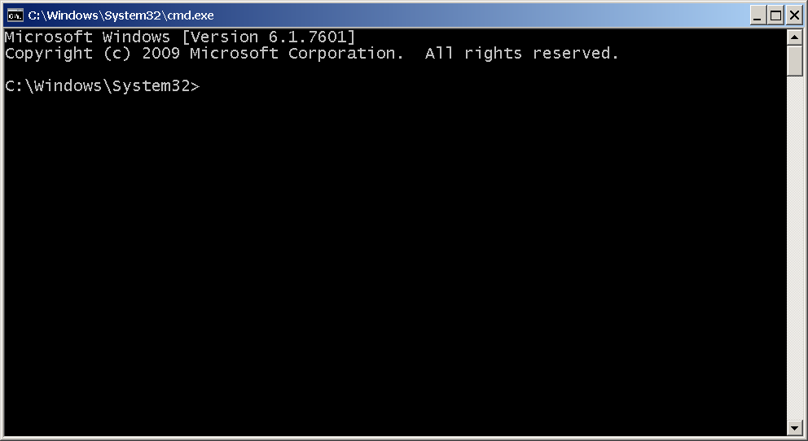

# Microsoft Windows 上的“你好，世界！”

> 原文： [https://docs.oracle.com/javase/tutorial/getStarted/cupojava/win32.html](https://docs.oracle.com/javase/tutorial/getStarted/cupojava/win32.html)

是时候编写你的第一个应用程序了！以下说明适用于 Windows Vista，Windows 7 和 Windows 8 的用户。其他平台的说明位于[“Hello World！”中。对于 Solaris OS 和 Linux](unix.html) 和[“Hello World！”用于 NetBeans IDE](netbeans.html) 。

如果您遇到本页说明中的问题，请参阅[常见问题（及其解决方案）](../problems/index.html)。

*   [清单](#win32-1)
*   [创建您的第一个应用程序](#win32-2)
    *   [创建源文件](#win32-2a)
    *   [将源文件编译为`.class`文件](#win32-2b)
    *   [运行程序](#win32-2c)

* * *

## A 清单

要编写第一个程序，您需要：

1.  Java SE 开发工具包 8（JDK 8）

    您可以[立即下载 Windows 版](http://www.oracle.com/technetwork/java/javase/downloads/index.html)。 （确保下载 **JDK** ，_ 而不是 _ JRE。）请参阅[安装说明](https://docs.oracle.com/javase/8/docs/technotes/guides/install/install_overview.html)。

2.  文本编辑器

    在这个例子中，我们将使用 Notepad，一个 Windows 平台附带的简单编辑器。如果使用其他文本编辑器，则可以轻松调整这些说明。

这两个项目是您编写第一个应用程序所需的全部内容。

* * *

## 创建您的第一个应用程序

您的第一个应用程序`HelloWorldApp`将只显示问候语“Hello world！”。要创建此程序，您将：

*   创建源文件

    源文件包含用 Java 编程语言编写的代码，您和其他程序员可以理解这些代码。您可以使用任何文本编辑器来创建和编辑源文件。

*   将源文件编译为.class 文件

    Java 编程语言 _ 编译器 _（`javac`）获取源文件并将其文本转换为 Java 虚拟机可以理解的指令。该文件中包含的指令称为 _ 字节码 _。

*   运行程序

    Java 应用程序 _ 启动程序工具 _（`java`）使用 Java 虚拟机来运行您的应用程序。

### 创建源文件

要创建源文件，您有两个选择：

*   您可以在计算机上保存文件 `[`HelloWorldApp.java`](../application/examples/HelloWorldApp.java)`，避免大量输入。然后，您可以直接[将源文件编译为`.class`文件](#win32-2b)。

*   或者，您可以使用以下（更长）说明。

首先，启动你的编辑器。您可以通过选择**程序&gt;从**开始**菜单启动记事本编辑器。配件&gt;记事本**。在新文档中，键入以下代码：

```java
/**
 * The HelloWorldApp class implements an application that
 * simply prints "Hello World!" to standard output.
 */
class HelloWorldApp {
    public static void main(String[] args) {
        System.out.println("Hello World!"); // Display the string.
    }
}

```

**输入**  时要小心

* * *

**Note:** Type all code, commands, and file names exactly as shown. Both the compiler (`javac`) and launcher (`java`) are _case-sensitive_, so you must capitalize consistently.

`HelloWorldApp` is _not_ the same as `helloworldapp`.

* * *

将代码保存在名为`HelloWorldApp.java`的文件中。要在记事本中执行此操作，请先选择**文件&gt;另存为**菜单项。然后，在**另存为**对话框中：

1.  使用**保存在**组合框中，指定保存文件的文件夹（目录）。在此示例中，`C`驱动器上的目录为`myapplication`。
2.  在**文件名**文本字段中，键入`"HelloWorldApp.java"`，包括引号。
3.  从**保存类型**组合框中，选择**文本文档（* .txt）**。
4.  在**编码**组合框中，将编码保留为 ANSI。

完成后，对话框应该看起来像  。


单击**保存**之前的“另存为”对话框。


现在单击**保存**，然后退出记事本。

### 将源文件编译为.class 文件

打开一个 shell 或“命令”窗口。您可以通过选择**运行...** 然后输入`cmd`从**开始**菜单执行此操作。 shell 窗口应该类似于，如下图。



一个 shell 窗口。


提示符显示 _ 当前目录 _。当您显示提示时，您当前的目录通常是 Windows XP 的主目录（如上图所示）。

要编译源文件，请将当前目录更改为文件所在的目录。例如，如果`C`驱动器上的源目录为`myapplication`，请在提示符下键入以下命令，然后按 **Enter** ：

```java
cd C:\myapplication

```

现在提示应该更改为`C:\myapplication&gt;`。

* * *

**Note:** 

要更改到其他驱动器上的目录，必须键入一个额外的命令：驱动器的名称。例如，要更改为`D`驱动器上的`myapplication`目录，必须输入`D:`，如下所示：

```java
C:\>D:

D:\>cd myapplication

D:\myapplication>
```

* * *

如果在提示符下输入`dir`，您应该看到源文件，如下所示：

```java
C:\>cd myapplication

C:\myapplication>dir
 Volume in drive C is System
 Volume Serial Number is F2E8-C8CC

 Directory of C:\myapplication

2014-04-24  01:34 PM    <DIR>          .
2014-04-24  01:34 PM    <DIR>          ..
2014-04-24  01:34 PM               267 HelloWorldApp.java
               1 File(s)            267 bytes
               2 Dir(s)  93,297,991,680 bytes free

C:\myapplication>
```

现在你准备编译了。在提示符下，键入以下命令并按**确定**。

```java
javac HelloWorldApp.java

```

编译器生成了一个字节码文件`HelloWorldApp.class`。在提示符下，键入`dir`以查看生成的新文件，如下所示：

```java
C:\myapplication>javac HelloWorldApp.java

C:\myapplication>dir
 Volume in drive C is System
 Volume Serial Number is F2E8-C8CC

 Directory of C:\myapplication

2014-04-24  02:07 PM    <DIR>          .
2014-04-24  02:07 PM    <DIR>          ..
2014-04-24  02:07 PM               432 HelloWorldApp.class
2014-04-24  01:34 PM               267 HelloWorldApp.java
               2 File(s)            699 bytes
               2 Dir(s)  93,298,032,640 bytes free

C:\myapplication>
```

现在你有一个`.class`文件，你可以运行你的程序。

如果您在此步骤中遇到问题，请参阅[常见问题（及其解决方案）](../problems/index.html)。

### 运行程序

在同一目录中，在提示符处输入以下命令：

```java
java -cp . HelloWorldApp

```

您应该在屏幕上看到以下内容：

```java
C:\myapplication>java -cp . HelloWorldApp
Hello World!

C:\myapplication>
```

恭喜！你的程序有效！

如果您在此步骤中遇到问题，请参阅[常见问题（及其解决方案）](../problems/index.html)。