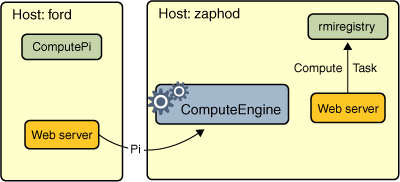

# 运行示例程序

> 原文： [https://docs.oracle.com/javase/tutorial/rmi/running.html](https://docs.oracle.com/javase/tutorial/rmi/running.html)

## 关于安全的说明

服务器和客户端程序在安装了安全管理器的情况下运行运行任一程序时，需要指定安全策略文件，以便为代码授予其运行所需的安全权限。以下是与服务器程序一起使用的示例[策略文件：](examples/server.policy)

```java
grant codeBase "file:/home/ann/src/" {
    permission java.security.AllPermission;
};

```

以下是与客户端程序一起使用的示例[策略文件：](examples/client.policy)

```java
grant codeBase "file:/home/jones/src/" {
    permission java.security.AllPermission;
};

```

对于两个示例策略文件，所有权限都授予程序的本地类路径中的类，因为本地应用程序代码是受信任的，但是没有权限授予从其他位置下载的代码。因此，计算引擎服务器限制它执行的任务（其代码不可信并且可能是恶意的）执行任何需要安全权限的操作。示例客户端的`Pi`任务不需要任何权限来执行。

在此示例中，服务器程序的策略文件名为`server.policy`，客户端程序的策略文件名为`client.policy`。

## 启动服务器

在启动计算引擎之前，您需要启动 RMI 注册表。 RMI 注册表是一个简单的服务器端引导程序命名工具，它使远程客户端能够获取对初始远程对象的引用。它可以使用`rmiregistry`命令启动。在执行`rmiregistry`之前，必须确保将运行`rmiregistry`的 shell 或窗口没有设置`CLASSPATH`环境变量或者具有不包含任何类路径的`CLASSPATH`环境变量您希望下载到远程对象的客户端。

要在服务器上启动注册表，请执行`rmiregistry`命令。此命令不产生输出，通常在后台运行。对于此示例，注册表在主机`mycomputer`上启动。

**Microsoft Windows** （如果`start`不可用，则使用`javaw`）：

```java
start rmiregistry

```

**Solaris OS 或 Linux** ：

```java
rmiregistry &

```

默认情况下，注册表在端口 1099 上运行。要在其他端口上启动注册表，请在命令行上指定端口号。不要忘记取消设置`CLASSPATH`环境变量。

**Microsoft Windows** ：

```java
start rmiregistry 2001

```

**Solaris OS 或 Linux** ：

```java
rmiregistry 2001 &

```

注册表启动后，您可以启动服务器。您需要确保`compute.jar`文件和远程对象实现类都在类路径中。启动计算引擎时，需要使用`java.rmi.server.codebase`属性指定服务器类可通过网络访问的位置。在此示例中，可供下载的服务器端类是`Compute`和`Task`接口，可在用户`ann`的`public_html\classes`目录的`compute.jar`文件中找到。计算引擎服务器在主机`mycomputer`上启动，该主机是启动注册表的主机。

**Microsoft Windows** ：

```java
java -cp c:\home\ann\src;c:\home\ann\public_html\classes\compute.jar
     -Djava.rmi.server.codebase=file:/c:/home/ann/public_html/classes/compute.jar
     -Djava.rmi.server.hostname=mycomputer.example.com
     -Djava.security.policy=server.policy
        engine.ComputeEngine

```

**Solaris OS 或 Linux** ：

```java
java -cp /home/ann/src:/home/ann/public_html/classes/compute.jar
     -Djava.rmi.server.codebase=http://mycomputer/~ann/classes/compute.jar
     -Djava.rmi.server.hostname=mycomputer.example.com
     -Djava.security.policy=server.policy
        engine.ComputeEngine

```

上面的`java`命令定义了以下系统属性：

*   `java.rmi.server.codebase`属性指定位置，即代码库 URL，从中可以下载来自此服务器的*类的定义。如果代码库指定了目录层次结构（而不​​是 JAR 文件），则必须在代码库 URL 的末尾包含一个尾部斜杠。_
*   `java.rmi.server.hostname`属性指定要放入此 Java 虚拟机中导出的远程对象的存根中的主机名或地址。此值是客户端在尝试传递远程方法调用时使用的主机名或地址。默认情况下，RMI 实现使用`java.net.InetAddress.getLocalHost` API 指示的服务器 IP 地址。但是，有时，此地址不适用于所有客户端，并且完全限定的主机名将更有效。要确保 RMI 使用可从所有潜在客户端路由的服务器的主机名（或 IP 地址），请设置`java.rmi.server.hostname`属性。
*   `java.security.policy`属性用于指定包含您要授予的权限的策略文件。

## 启动客户端

注册表和计算引擎运行后，您可以启动客户端，指定以下内容：

*   客户端使用`java.rmi.server.codebase`属性为其类（`Pi`类）提供服务的位置
*   `java.security.policy`属性，用于指定包含您要授予各种代码的权限的安全策略文件
*   作为命令行参数，服务器的主机名（以便客户端知道`Compute`远程对象的位置）以及计算中使用的小数位数

在另一台主机（例如，名为`mysecondcomputer`的主机）上启动客户端，如下所示：

* * *

**Microsoft Windows** ：

```java
java -cp c:\home\jones\src;c:\home\jones\public_html\classes\compute.jar
     -Djava.rmi.server.codebase=file:/c:/home/jones/public_html/classes/
     -Djava.security.policy=client.policy
        client.ComputePi mycomputer.example.com 45

```

**Solaris OS 或 Linux** ：

```java
java -cp /home/jones/src:/home/jones/public_html/classes/compute.jar
     -Djava.rmi.server.codebase=http://mysecondcomputer/~jones/classes/
     -Djava.security.policy=client.policy
        client.ComputePi mycomputer.example.com 45

```

请注意，类路径是在命令行上设置的，以便解释器可以找到客户端类和包含接口的 JAR 文件。另请注意，指定目录层次结构的`java.rmi.server.codebase`属性的值以尾部斜杠结尾。

启动客户端后，将显示以下输出：

```java
3.141592653589793238462643383279502884197169399

```

下图说明了`rmiregistry`，`ComputeEngine`服务器和`ComputePi`客户端在程序执行期间获取类的位置。



当`ComputeEngine`服务器在注册表中绑定其远程对象引用时，注册表会下载存根类所依赖的`Compute`和`Task`接口。这些类是从`ComputeEngine`服务器的 Web 服务器或文件系统下载的，具体取决于启动服务器时使用的代码库 URL 的类型。

因为`ComputePi`客户端在其类路径中同时具有`Compute`和`Task`接口，所以它从类路径加载它们的定义，而不是从服务器的代码库加载它们的定义。

最后，当`Pi`对象在`executeTask`对象的`executeTask`远程调用中传递时，`Pi`类被加载到`ComputeEngine`服务器的 Java 虚拟机中。 `Pi`类由服务器从客户端的 Web 服务器或文件系统加载，具体取决于启动客户端时使用的代码库 URL 的类型。