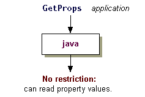

# 观察应用程序自由

> 原文： [https://docs.oracle.com/javase/tutorial/security/tour2/step1.html](https://docs.oracle.com/javase/tutorial/security/tour2/step1.html)

当 _ 应用程序 _ 运行时，安全管理器 _ 不会自动安装 _。在[下一步](step3.html)中，您将看到如何将相同的安全策略应用于本地文件系统上的应用程序，以及下载的沙箱小程序。但首先，让我们演示默认情况下没有为应用程序安装安全管理器，因此应用程序可以完全访问资源。

通过复制或下载 [`GetProps.java`](examples/GetProps.java) 源代码在计算机上创建名为`GetProps.java`的文件。

本课程中的示例假定您将`GetProps.java`放在`C:\Test`目录中，如果您使用的是 Windows 系统或 UNIX 上的`~/test`目录。

如您所见，如果检查源文件，该程序将尝试获取（读取）属性值，其名称为`"os.name"`，`"java.version"`，`"user.home"`和`"java.home"`。

现在编译并运行`GetProps.java`。您应该看到如下输出：

```
C:\TEST>java GetProps
    About to get os.name property value
      The name of your operating system is:
      Windows XP
    About to get java.version property value
      The version of the JVM you are running is:
      1.6.0
    About to get user.home property value
      Your user home directory is: C:\WINDOWS
    About to get java.home property value
      Your JRE installation directory is:
      C:\JDK7.0.0\JRE

```

这表明允许应用程序访问所有属性值，如下图所示。

<center></center>