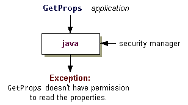

# 请参见如何限制应用程序

> 原文： [https://docs.oracle.com/javase/tutorial/security/tour2/step2.html](https://docs.oracle.com/javase/tutorial/security/tour2/step2.html)

正如您在[上一步](step1.html)中看到的那样，Java 运行时 _ 不会 _ 在运行 _ 应用程序 _ 时自动安装安全管理器。要将相同的安全策略应用于本地文件系统上的应用程序以及下载的沙盒小程序，您可以使用新的`-Djava.security.manager`命令行参数调用解释器。

要使用默认安全管理器执行`GetProps`应用程序，请键入以下内容：

```
java -Djava.security.manager GetProps

```

这是程序的输出：

```
C:\TEST>java -Djava.security.manager GetProps
    About to get os.name property value
      The name of your operating system is: SunOS
    About to get java.version property value
      The version of the JVM you are running is: 1.7.0
    About to get user.home property value
    Caught exception java.security.AccessControlException:
        access denied ("java.util.PropertyPermission"
        "user.home" "read")

```

该过程如下图所示。

<center></center>

## 安全敏感属性

Java 运行时默认加载默认策略文件，并授予所有代码访问一些常用属性的权限，例如`"os.name"`和`"java.version"`。这些属性对安全性不敏感，因此授予这些权限通常不会带来安全风险。

其他属性`GetProps`尝试访问，`"user.home"`和`"java.home"`，系统策略文件授予读取权限的属性中的 _ 不是 _。因此，只要`GetProps`尝试访问其中第一个属性（`"user.home"`），安全管理器就会阻止访问并报告`AccessControlException`。此异常表示当前有效的策略（由一个或多个策略文件中的条目组成）不允许读取`"user.home"`属性的权限。

* * *

**Note:** Code can always read a file from the same directory it is in (or a subdirectory of that directory); it does not need explicit permission to do so. Code can also obtain the pathname of the directory it is executed from, and this pathname may contain sensitive information. For example, if code is executed from a home directory (or a subdirectory of the home directory), the pathname may reveal the name of the current user.

* * *

## 默认策略文件

默认策略文件 [`java.policy`](examples/java.policy) （默认情况下）位于：

*   **Windows** ： `_java.home_ \ lib \ security \ java.policy`
*   **UNIX** ： `_java.home_ /lib/security/java.policy`

请注意， _java.home_ 表示`"java.home"`属性的值，该属性是指定安装 JRE 的目录的系统属性。因此，如果 JRE 安装在 Windows 上名为`C:\jdk\jre`的目录和 UNIX 上的`/jdk/jre`目录中，则系统策略文件位于：

*   **Windows** ：`C:\jdk\jre\lib\security\java.policy`
*   **UNIX** ：`/jdk/jre/lib/security/java.policy`