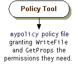

# 设置策略文件以授予所需权限

> 原文： [https://docs.oracle.com/javase/tutorial/security/tour2/step3.html](https://docs.oracle.com/javase/tutorial/security/tour2/step3.html)

此步骤使用策略工具实用程序打开在[创建策略文件](../tour1/index.html)课程中创建的名为 **`examplepolicy`** 的策略文件。您将添加一个新的策略条目，从存储`GetProps.class`的目录中授予代码权限，以读取`"user.home"`和`"java.home"`属性值，如下图所示。

步骤如下。

1.  [打开政策文件](wstep1.html)
2.  [授予所需权限](wstep2.html)
3.  [保存策略文件](wstep3.html)

* * *

**Note for UNIX Users:** The instructions illustrate creating the policy file for a Windows system. The steps are exactly the same if you are working on a UNIX system, with the following differences.

*   从主目录中的`test`目录中检索`examplepolicy`文件。
*   对于授予所需权限的步骤中的 **CodeBase** URL，可以将`file:${user.home}/test/`替换为`file:/C:/Test/`。或者，您可以直接指定主目录，而不是像`file:/home/jones/test/`中那样引用`"user.home"`属性。

* * *