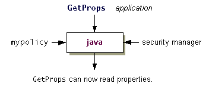

# 请参阅策略文件效果

> 原文： [https://docs.oracle.com/javase/tutorial/security/tour2/step4.html](https://docs.oracle.com/javase/tutorial/security/tour2/step4.html)

现在您已将所需的策略条目添加到`examplepolicy`策略文件，您应该能够在使用安全管理器执行`GetProps`应用程序时读取指定的属性，如下图所示。



无论何时运行 applet 或带有安全管理器的应用程序，默认加载和使用的策略文件都是**“安全属性文件”**中指定的策略文件，它位于以下某个位置目录：

*   **Windows** ： `_java.home_ \ lib \ security \ java.security`
*   **UNIX** ： `_java.home_ /lib/security/java.security`

**注意：** `java.home`环境变量命名安装 JRE 的目录。

策略文件位置被指定为名称采用以下形式的属性的值：

```java
policy.url.n

```

变量`n`表示数字的位置。在采用以下形式的行中指定每个属性值：

```java
policy.url.n=URL

```

其中 _URL_ 是 URL 规范。例如，默认策略文件（有时分别称为系统和用户策略文件）在安全属性文件中定义为

```java
policy.url.1=file:${java.home}/lib/security/java.policy
policy.url.2=file:${user.home}/.java.policy

```

* * *

**Note:** Use of the notation `${propName}` in the security properties file is a way of specifying the value of a property. Thus `${java.home}` will be replaced at runtime by the actual value of the `"java.home"` property, which indicates the directory into which the JRE was installed, and `${user.home}` will be replaced by the value of the `"user.home"` property, for example, `C:\Windows`.

* * *

除了安全属性文件中指定的策略文件之外，还有两种方法可以将`examplepolicy`文件视为整体策略的一部分。您可以在传递给运行时系统的属性中指定其他策略文件，如[方法 1](#Approach1) 中所述，或在安全属性文件中添加一行指定其他策略文件，如[中所述方法 2](#Approach2) 。

您可以使用`-Djava.security.policy`解释器命令行参数指定除安全属性文件中指定的策略文件外还应使用的策略文件。

确保您位于包含`GetProps.class`和`examplepolicy`的目录中。然后，您可以运行`GetProps`应用程序并通过在一行上键入以下命令将`examplepolicy`策略文件传递给解释器：

```java
java -Djava.security.manager -Djava.security.policy=examplepolicy GetProps

```

**注意：**请记住，为了使用安全管理器运行应用程序，需要`-Djava.security.manager`，如[参见如何限制应用程序](step2.html)步骤所示。

程序报告`"user.home"`和`"java.home"`属性的值。

如果应用程序仍报告错误，则策略文件中存在错误。使用策略工具检查您刚刚在[设置策略文件以授予所需权限](step3.html)步骤中创建的策略条目。

您可以在安全属性文件的`policy.url.n`属性中指定多个 URL，并且将加载所有指定的策略文件。因此，`java`解释器考虑`examplepolicy`文件的策略条目的一种方法是在安全属性文件中添加一个指定该策略文件的条目。

* * *

**Important:** If you are running your own copy of the JDK, you can easily edit your security properties file. If you are running a version shared with other users, you may only be able to modify the system-wide security properties file if you have write access to it or if you ask your system administrator to modify the file when appropriate. However, it's probably not appropriate for you to make modifications to a system-wide policy file for this tutorial test. We suggest that you just read the following to see how it is done or that you install your own private version of the JDK to use for the tutorial lessons.

* * *

要修改安全属性文件，请在适合编辑 ASCII 文本文件的编辑器中将其打开。然后在包含`policy.url.2`的行之后添加以下行：如果您在 Windows 系统上，请添加

```java
policy.url.3=file:/C:/Test/examplepolicy

```

如果您使用的是 UNIX 系统，请添加

```java
policy.url.3=file:${user.home}/test/examplepolicy

```

在 UNIX 系统上，您也可以显式指定主目录，如

```java
policy.url.3=file:/home/jones/test/examplepolicy

```

现在您应该能够成功运行以下内容。

```java
java -Djava.security.manager GetProps

```

与方法 1 一样，如果仍然遇到安全性异常，则策略文件中存在错误。使用策略工具检查您刚刚在[设置策略文件以授予所需权限](step3.html)步骤中创建的策略条目。然后修复任何拼写错误或其他错误。

* * *

* * *

**Important:** You do not need to include the `examplepolicy` file unless you are running this Tutorial lesson. To exclude this file, open the security properties file and delete the line you just added.

Before continuing, you may want to delete the line you just added in the security properties file (or comment it out), since you probably do not want the `examplepolicy` file included when you are not running the tutorial lessons.

* * *