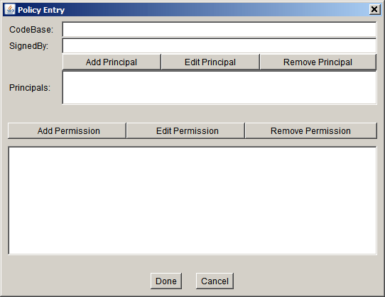
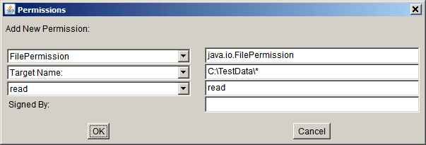
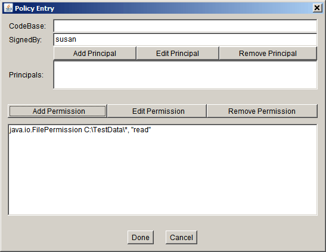

# 添加带有 SignedBy 别名的策略条目

> 原文： [https://docs.oracle.com/javase/tutorial/security/toolsign/wstep3.html](https://docs.oracle.com/javase/tutorial/security/toolsign/wstep3.html)

要授予`susan`权限签名的代码以读取`C:\TestData`目录中的任何文件，您需要创建一个授予此权限的策略条目。请注意，“由`susan`签名的代码”是在 JAR 文件中包含的类文件中的代码的缩写方式，其中 JAR 文件使用与密钥库证书中出现的公钥对应的私钥进行签名。 `susan`别名的条目。“

在主策略工具窗口中选择**添加策略条目**按钮。这将打开“策略条目”对话框：

<center></center>

使用此对话框，在 **SignedBy** 文本框中键入以下别名：

```
susan

```

将 **CodeBase** 文本框留空，以授予 _`susan`签名的所有 _ 代码的权限，无论它来自何处。

* * *

**Note:** If you wanted to restrict the permission to just code signed by `susan` that comes from the `C:\Test\` directory, you would type the following URL into the **CodeBase** text box:

```
file:/C:/Test/*

```

* * *

要添加权限，请选择**添加权限**按钮。这将打开“权限”对话框。

<center></center>

请执行下列操作。

1.  从权限下拉列表中选择**文件权限**。完整的权限类型名称（`java.io.FilePermission`）现在显示在下拉列表右侧的文本框中。
2.  在标记为目标名称的列表右侧的文本框中键入以下内容，以指定`C:\TestData\`目录中的所有文件：

    ```
      C：\ TestData \ *  
    ```

3.  通过从“操作”下拉列表中选择**读取**选项来指定读取访问权限。

现在，“权限”对话框如下所示。

<center></center>

选择 **OK** 按钮。新权限显示在“策略条目”对话框的一行中，如下所示。

<center></center>

* * *

**Note:** Each backslash in the file path you typed has been replaced with two backslashes, for your convenience. Strings in a policy file are processed by a tokenizer that allows \ to be used as an escape character (for example, `\n` to indicate a new line), so the policy file requires _two_ backslashes to indicate a single backslash. If you use single backslashes as your directory separators, Policy Tool automatically converts them to double backslashes for you.

* * *

您现在已完成指定此策略条目，因此请在“策略条目”对话框中选择**完成**按钮。 Policy Tool 窗口现在包含一条代表策略条目的行，显示 **SignedBy** 值。