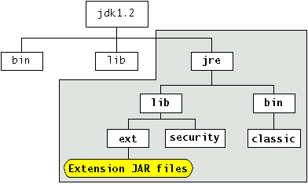

# 已安装的扩展程序

> 原文： [https://docs.oracle.com/javase/tutorial/ext/basics/install.html](https://docs.oracle.com/javase/tutorial/ext/basics/install.html)

已安装的扩展是 Java Runtime Environment（JRE™）软件的 `lib / ext` 目录中的 JAR 文件。顾名思义，JRE 是 Java Development Kit 的运行时部分，包含平台的核心 API，但没有编译器和调试器等开发工具。 JRE 可以单独使用，也可以作为 Java Development Kit 的一部分使用。

JRE 是 JDK 软件的严格子集。 JDK 软件目录树的子集如下所示：

<center></center>

JRE 由图中突出显示的框内的那些目录组成。无论您的 JRE 是独立的还是 JDK 软件的一部分，JRE 目录的 `lib / ext` 中的任何 JAR 文件都会被运行时环境自动视为扩展。

由于已安装的扩展扩展了平台的核心 API，因此请谨慎使用它们。它们很少适用于单个或一小组应用程序使用的接口。

此外，由于安装的扩展定义的符号将在所有 Java 进程中可见，因此应注意确保所有可见符号遵循适当的“反向域名”和“类层次结构”约定。例如， `com.mycompany.MyClass` 。

从 Java 6 开始，扩展 JAR 文件也可以放置在独立于任何特定 JRE 的位置，以便扩展可以由系统上安装的所有 JRE 共享。在 Java 6 之前， `java.ext.dirs` 的值引用了单个目录，但是从 Java 6 开始，它是一个目录列表（如 `CLASSPATH` ），它指定了位置在哪里搜索扩展名。路径的第一个元素始终是 JRE 的 `lib / ext` 目录。第二个元素是 JRE 之外的目录。此其他位置允许扩展 JAR 文件安装一次，并由该系统上安装的多个 JRE 使用。位置因操作系统而异：

*   Solaris™操作系统： `/ usr / jdk / packages / lib / ext`
*   Linux： `/ usr / java / packages / lib / ext`
*   Microsoft Windows：`％SystemRoot％\ Sun \ Java \ lib \ ext`

请注意，放置在上述目录之一中的已安装扩展程序扩展了 _ 平台上每个 _ 的 JRE（Java 6 或更高版本）。

## 一个简单的例子

让我们创建一个简单的已安装扩展。我们的扩展由一个类 `RectangleArea` 组成，它计算矩形区域：

```
public final class RectangleArea {
    public static int area(java.awt.Rectangle r) {
        return r.width * r.height;
    }
}

```

这个类有一个方法，`区域`，它接受 `java.awt.Rectangle` 的一个实例并返回矩形的区域。

假设您要使用名为`AreaApp`的应用程序测试 `RectangleArea` ：

```
import java.awt.*;

public class AreaApp {
    public static void main(String[] args) {
        int width = 10;
        int height = 5;

        Rectangle r = new Rectangle(width, height);
        System.out.println("The rectangle's area is " 
                           + RectangleArea.area(r));
    }
}

```

该应用程序实例化一个 10 `x` 5 矩形，然后使用 `RectangleArea.area` 方法打印出矩形区域。

## 在没有扩展机制的情况下运行 AreaApp

让我们首先回顾一下如何在不使用扩展机制的情况下运行`AreaApp`应用程序。我们假设 `RectangleArea` 类捆绑在名为 `area.jar` 的 JAR 文件中。

当然， `RectangleArea` 类不是 Java 平台的一部分，因此您需要将 `area.jar` 文件放在类路径上才能运行`AreaApp`而不会获取运行时异常。例如，如果 `area.jar` 位于目录 `/ home / user` 中，则可以使用此命令：

```
java -classpath .:/home/user/area.jar AreaApp 

```

此命令中指定的类路径包含当前目录，包含 `AreaApp.class` ，以及包含 `RectangleArea` 包的 JAR 文件的路径。您可以通过运行此命令获得所需的输出：

```
The rectangle's area is 50

```

## 使用扩展机制运行 AreaApp

现在让我们看一下如何使用 `RectangleArea` 类作为扩展来运行`AreaApp`。

要将 `RectangleArea` 类转换为扩展名，请将文件 `area.jar` 放在 JRE 的 `lib / ext` 目录中。自动执行此操作会为 `RectangleArea` 提供已安装扩展的状态。

将 `area.jar` 作为扩展名安装，无需指定类路径即可运行`AreaApp`：

```
java AreaApp 

```

因为您使用 `area.jar` 作为已安装的扩展，所以即使您没有在类路径上指定它，运行时环境也能够找到并加载`RectangleArea`类。同样，系统上任何用户运行的任何 applet 或应用程序都可以找到并使用 `RectangleArea` 类。

如果系统上安装了多个 JRE（Java 6 或更高版本），并希望 `RectangleArea` 类可用作所有 JRE 的扩展，而不是将其安装在 `lib / ext 中`特定 JRE 的目录，安装在系统范围的位置。例如，在运行 Linux 的系统上，在目录 `/ usr / java / packages / lib / ext` 中安装 `area.jar` 。然后 `AreaApp` 可以使用安装在该系统上的不同 JRE 运行，例如，如果将不同的浏览器配置为使用不同的 JRE。