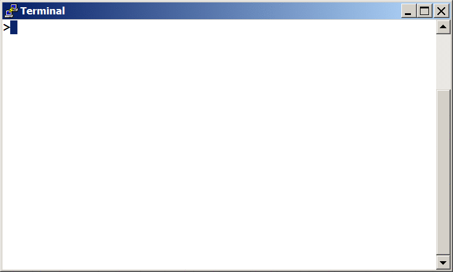
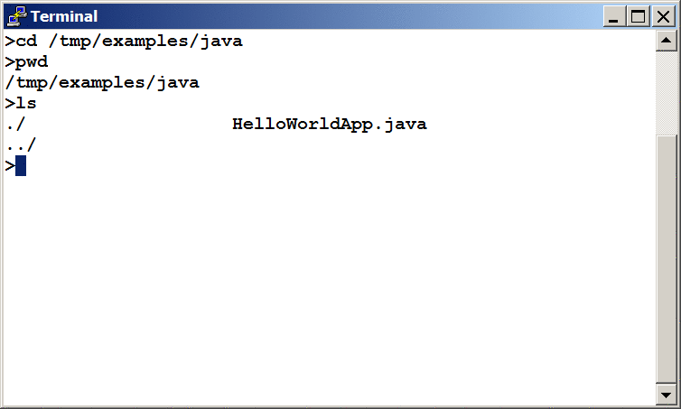
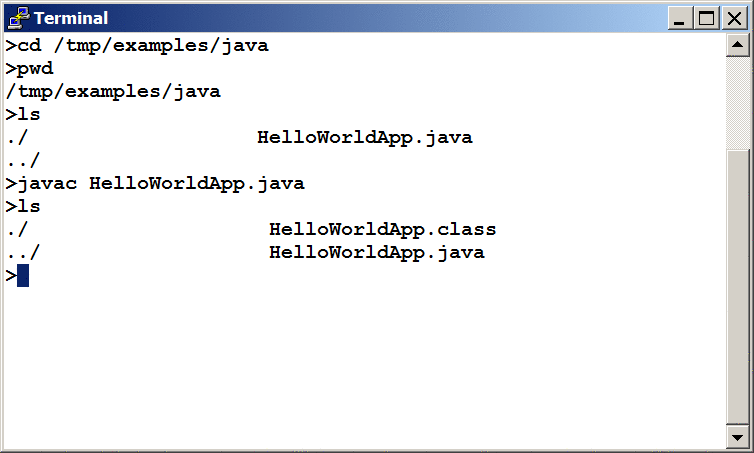
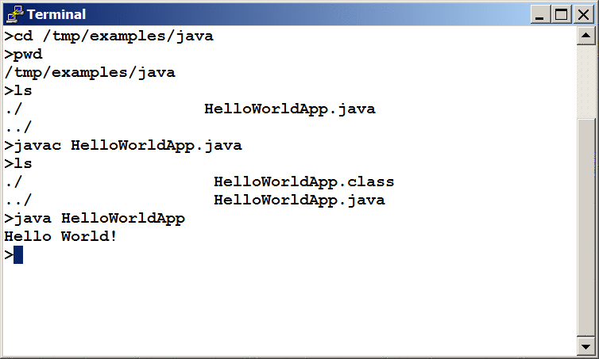

# Solaris OS 和 Linux 上的“你好，世界！”

> 原文： [https://docs.oracle.com/javase/tutorial/getStarted/cupojava/unix.html](https://docs.oracle.com/javase/tutorial/getStarted/cupojava/unix.html)

是时候编写你的第一个应用程序了！这些详细说明适用于 Solaris OS 和 Linux 的用户。其他平台的说明见[“Hello World！”对于 Microsoft Windows](win32.html) 和[“Hello World！”用于 NetBeans IDE](netbeans.html) 。

如果您遇到本页说明中的问题，请参阅[常见问题（及其解决方案）](../problems/index.html)。

*   [清单](#unix-1)
*   [创建您的第一个应用程序](#unix-2)
    *   [创建源文件](#unix-2a)
    *   [将源文件编译为`.class`文件](#unix-2b)
    *   [运行程序](#unix-2c)

* * *

## A 清单

要编写第一个程序，您需要：

1.  Java SE 开发工具包 8（JDK 8）

    您现在可以[下载 Solaris OS 或 Linux 版本](http://www.oracle.com/technetwork/java/javase/downloads/index.html)。 （确保下载 **JDK** ，_ 而不是 _ JRE。）请参阅[安装说明](https://docs.oracle.com/javase/8/docs/technotes/guides/install/install_overview.html)。

2.  文本编辑器

    在这个例子中，我们将使用 Pico，一个可用于许多基于 UNIX 的平台的编辑器。如果使用其他文本编辑器，例如`vi`或`emacs`，则可以轻松调整这些说明。

这两个项目是您编写第一个应用程序所需的全部内容。

* * *

## 创建您的第一个应用程序

您的第一个应用程序`HelloWorldApp`将只显示问候语“Hello world！”。要创建此程序，您将：

*   创建源文件

    源文件包含用 Java 编程语言编写的代码，您和其他程序员可以理解这些代码。您可以使用任何文本编辑器来创建和编辑源文件。

*   将源文件编译为.class 文件

    Java 编程语言 _ 编译器 _（`javac`）获取源文件并将其文本转换为 Java 虚拟机可以理解的指令。此`.class`文件中包含的指令称为 _ 字节码 _。

*   运行程序

    Java 应用程序 _ 启动程序工具 _（`java`）使用 Java 虚拟机来运行您的应用程序。

### 创建源文件

要创建源文件，您有两个选择：

*   您可以在计算机上保存文件 `[`HelloWorldApp.java`](../application/examples/HelloWorldApp.java)`，避免大量输入。然后，您可以直接进入[编译源文件](#unix-2b)。

*   或者，您可以使用以下（更长）说明。

首先，打开一个 shell 或“终端”窗口。



一个新的终端窗口。


当您第一次出现提示时，您的 _ 当前目录 _ 通常是您的 _ 主目录 _。您可以随时在提示符下键入`cd`，然后按**返回**，将当前目录更改为主目录。

您创建的源文件应保存在单独的目录中。您可以使用命令`mkdir`创建目录。例如，要在 `/ tmp` 目录中创建目录`examples/java`，请使用以下命令：

```
cd /tmp
mkdir examples
cd examples
mkdir java

```

要将当前目录更改为此新目录，请输入：

```
cd /tmp/examples/java

```

现在您可以开始创建源文件了。

在提示符下键入`pico`并按**返回**，启动 Pico 编辑器。如果系统响应消息`pico: command not found`，则 Pico 很可能不可用。有关更多信息，请咨询系统管理员，或使用其他编辑器。

当你启动 Pico 时，它会显示一个新的空白 _ 缓冲区 _。这是您键入代码的区域。

在新缓冲区中键入以下代码：

```
/**
 * The HelloWorldApp class implements an application that
 * simply prints "Hello World!" to standard output.
 */
class HelloWorldApp {
    public static void main(String[] args) {
        System.out.println("Hello World!"); // Display the string.
    }
}

```

**输入**  时要小心

* * *

**Note:** Type all code, commands, and file names exactly as shown. Both the compiler (`javac`) and launcher (`java`) are _case-sensitive_, so you must capitalize consistently.

`HelloWorldApp` is _not_ the same as `helloworldapp`.

* * *

将代码保存在名为`HelloWorldApp.java`的文件中。在 Pico 编辑器中，您可以通过键入 **Ctrl-O** 来执行此操作，然后在底部看到提示`File Name to write:`，进入要创建文件的目录，然后按`HelloWorldApp.java` ]。例如，如果要将`HelloWorldApp.java`保存在目录`/tmp/examples/java`中，则键入`/tmp/examples/java/HelloWorldApp.java`并按**返回**。

您可以输入 **Ctrl-X** 退出 Pico。

### 将源文件编译为`.class`文件

打开另一个 shell 窗口。要编译源文件，请将当前目录更改为文件所在的目录。例如，如果源目录是`/tmp/examples/java`，请在提示符下键入以下命令，然后按**返回**：

```
cd /tmp/examples/java

```

如果在提示符处输入`pwd`，您应该看到当前目录，在此示例中已更改为`/tmp/examples/java`。

如果在提示符下输入`ls`，则应该看到您的文件。



`ls`命令的结果，显示`.java`源文件。


现在准备好编译源文件了。在提示符下，键入以下命令并按**返回**。

```
javac HelloWorldApp.java

```

编译器生成了一个字节码文件`HelloWorldApp.class`。在提示符下，键入`ls`以查看生成的新文件：如下图。



`ls`命令的结果，显示生成的`.class`文件。


现在你有一个`.class`文件，你可以运行你的程序。

如果您在此步骤中遇到问题，请参阅[常见问题（及其解决方案）](../problems/index.html)。

### 运行程序

在同一目录中，在提示符下输入：

```
java HelloWorldApp

```

下一个图显示了你现在应该看到的内容。



输出打印“Hello World！”到屏幕。


恭喜！你的程序有效！

如果您在此步骤中遇到问题，请参阅[常见问题（及其解决方案）](../problems/index.html)。