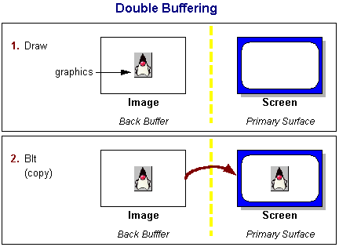
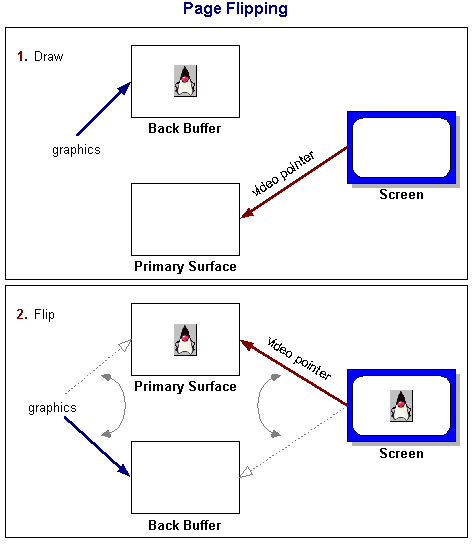

# 双缓冲和翻页

> 原文： [https://docs.oracle.com/javase/tutorial/extra/fullscreen/doublebuf.html](https://docs.oracle.com/javase/tutorial/extra/fullscreen/doublebuf.html)

假设您必须逐个像素或逐行在屏幕上绘制整个图片。如果你要直接在屏幕上绘制这样的东西（比如说， `Graphics.drawLine` ），你可能会非常失望地注意到需要一点时间。您甚至可能会注意到图片绘制方式的可见瑕疵。大多数程序员使用称为 _ 双缓冲 _ 的技术，而不是以这种方式和按照这种速度观察事物。

Java 应用程序中传统的双缓冲概念非常简单：创建一个屏幕外图像，使用图像的图形对象绘制到该图像，然后，一步，使用目标窗口的图形对象调用 `drawImage` ，屏幕外的图像。您可能已经注意到 Swing 在其许多组件中使用此技术，通常默认情况下使用 `setDoubleBuffered` 方法启用。

屏幕表面通常被称为 _ 主表面 _，并且用于双缓冲的屏幕外图像通常被称为 _ 后缓冲器 _。将内容物从一个表面复制到另一个表面的行为通常被称为块线转移，或 _blitting_ （blt 通常发音为“blit”并且不应与 BLT 三明治混淆）。

主表面通常通过任何显示组件的图形对象进行操作;在全屏模式下，使用全屏窗口图形的任何操作都是对屏幕内存的直接操作。因此，您可以利用全屏独占模式中的其他功能，否则由于窗口系统的开销而无法使用这些功能。一种仅在全屏独占模式下可用的技术是称为 _ 页面翻转 _ 的双缓冲形式。

## 页面翻转

许多显卡都有 _ 视频指针 _ 的概念，它只是视频内存中的一个地址。该指针告诉图形卡在下一个刷新周期中在哪里查找要显示的视频内容。在某些图形卡和某些操作系统中，甚至可以通过编程方式操作此指针。假设您创建了一个具有精确宽度，高度和位深度的后缓冲区（在视频内存中），然后以与使用双缓冲相同的方式绘制到该缓冲区。现在想象一下，如果不是像双缓冲那样将图像模糊到屏幕上，而是将视频指针改为后缓冲区，会发生什么。在下一次刷新期间，图形卡现在将使用您的图像显示。这个开关称为页面翻转，基于 blt 的双缓冲的性能提升是只需要在内存中移动一个指针，而不是将整个内容从一个缓冲区复制到另一个缓冲区。

当发生页面翻转时，指向旧后台缓冲区的指针现在指向主表面，而指向旧主表面的指针现在指向后台缓冲区内存。这会自动为下一次绘制操作设置。

有时在 _ 翻转链 _ 中设置多个后缓冲区是有利的。当绘图所花费的时间大于显示器的刷新率时，这尤其有用。翻转链只是两个或多个后缓冲区（有时称为 _ 中间缓冲区 _）加上主表面（这有时称为三缓冲，四重缓冲等）。在翻转链中，下一个可用的后缓冲区变为主表面等，一直到最后面的后缓冲区，用于绘制。

## 双缓冲和页面翻转的好处

如果您的性能指标只是双缓冲或页面翻转的速度与直接渲染相比，您可能会感到失望。您可能会发现直接渲染的数字远远超过双缓冲的数字，并且这些数字远远超过页面翻转的数字。这些技术中的每一种都用于改善 _ 感知性能 _，这在图形应用中比 _ 数值性能 _ 更重要。

双缓冲主要用于消除可见的绘制，这可能使应用程序看起来像业余，缓慢或看起来闪烁。页面翻转主要用于消除 _ 撕裂 _，当绘制到屏幕时发生的分裂效果比监视器的刷新率更快。更平滑的绘图意味着更好的感知性能和更好的用户体验。