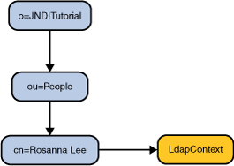

# 查找对象

> 原文： [https://docs.oracle.com/javase/tutorial/jndi/ops/lookup.html](https://docs.oracle.com/javase/tutorial/jndi/ops/lookup.html)

要从命名服务中查找对象，请使用 [`Context.lookup（）`](https://docs.oracle.com/javase/8/docs/api/javax/naming/Context.html#lookup-javax.naming.Name-) 并将其传递给要检索的对象的名称。假设命名服务中有一个名为 `cn = Rosanna Lee，ou = People` 的对象。要检索对象，您可以编写

```java
Object obj = ctx.lookup("cn=Rosanna Lee,ou=People");

```

`lookup（）`返回的对象类型取决于底层命名系统和与对象本身关联的数据。命名系统可以包含许多不同类型的对象，并且在系统的不同部分中查找对象可能产生不同类型的对象。在这个例子中，`“cn = Rosanna Lee，ou = People”`恰好绑定到上下文对象（ `javax.naming.ldap.LdapContext` ）。您可以将 `lookup（）`的结果转换为其目标类。

例如，以下代码查找对象`“cn = Rosanna Lee，ou = People”`并将其转换为 `LdapContext` 。

```java
import javax.naming.ldap.LdapContext;
...
LdapContext ctx = (LdapContext) ctx.lookup("cn=Rosanna Lee,ou=People");

```

完整的例子在文件 [``Lookup.java` `](examples/Lookup.java)中。



Java SE 6 中有两种新的静态方法可用于查找名称：

*   [`InitialContext.doLookup（名称名称）`](https://docs.oracle.com/javase/8/docs/api/javax/naming/InitialContext.html#doLookup-javax.naming.Name-)
*   [`InitialContext.doLookup（String name）`](https://docs.oracle.com/javase/8/docs/api/javax/naming/InitialContext.html#doLookup-java.lang.String-)

这些方法提供了查找名称的快捷方式，而无需实例化 InitialContext。