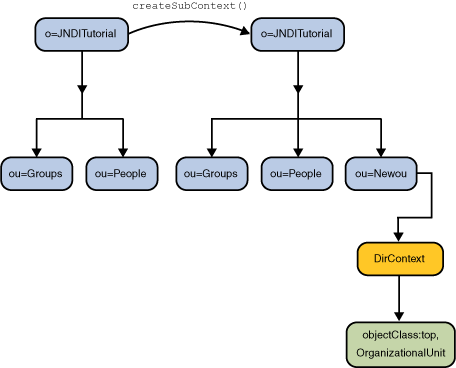

# 创建和销毁子上下文

> 原文： [https://docs.oracle.com/javase/tutorial/jndi/ops/create.html](https://docs.oracle.com/javase/tutorial/jndi/ops/create.html)

`上下文`接口包含[创建](#CREATE)和[破坏](#DESTROY)和 _ 子上下文 _ 的方法，HTG7 是在同一类型的另一个上下文中绑定的上下文。

此处描述的示例使用具有 _ 属性 _ 的对象并在目录中创建子上下文。您可以使用这些 `DirContext` 方法在将绑定或子上下文添加到命名空间时将属性与对象相关联。例如，您可以创建 `Person` 对象并将其绑定到命名空间，同时关联该 `Person` 对象的属性。等效命名将没有属性。

createSubcontext（）与 bind（）的不同之处在于它创建了一个新的 Object，即绑定到目录的新 Context，而 bind（）绑定目录中的给定 Object。

要创建命名上下文，请向 [`createSubcontext（）`](https://docs.oracle.com/javase/8/docs/api/javax/naming/Context.html#createSubcontext-javax.naming.Name-) 提供要创建的上下文的名称。要创建具有属性的上下文，请向 [`DirContext.createSubcontext（）`](https://docs.oracle.com/javase/8/docs/api/javax/naming/directory/DirContext.html#createSubcontext-javax.naming.Name-javax.naming.directory.Attributes-) 提供要创建的上下文的名称及其属性。

* * *

**继续之前：**本课程中的示例要求您添加架构。您必须关闭 LDAP 服务器中的模式检查，或将本教程附带的 [`the schema`](../software/config/java.schema) 添加到服务器。这两项任务通常由目录服务器的管理员执行。请参阅 [LDAP 设置](../software/content.html)课程。

* * *

```
// Create attributes to be associated with the new context
Attributes attrs = new BasicAttributes(true); // case-ignore
Attribute objclass = new BasicAttribute("objectclass");
objclass.add("top");
objclass.add("organizationalUnit");
attrs.put(objclass);

// Create the context
Context result = ctx.createSubcontext("NewOu", attrs);

```

[`This example`](examples/Create.java) 创建一个名为`“ou = NewOu”`的新上下文，它有一个属性`“objectclass”`，有两个值，`“top”` ]和`“organizationalUnit”`，在上下文 `ctx` 中。

```
# java Create
ou=Groups: javax.naming.directory.DirContext
ou=People: javax.naming.directory.DirContext
ou=NewOu: javax.naming.directory.DirContext

```

[`This example`](examples/Create.java) 创建一个新的上下文，称为`“NewOu”`，它是 `ctx` 的孩子。



要销毁上下文，请向 [`destroySubcontext（）`](https://docs.oracle.com/javase/8/docs/api/javax/naming/Context.html#destroySubcontext-javax.naming.Name-) 提供要销毁的上下文的名称。

```
// Destroy the context
ctx.destroySubcontext("NewOu");

```

[`This example`](examples/Destroy.java) 在上下文 `ctx` 中破坏上下文`“NewOu”`。